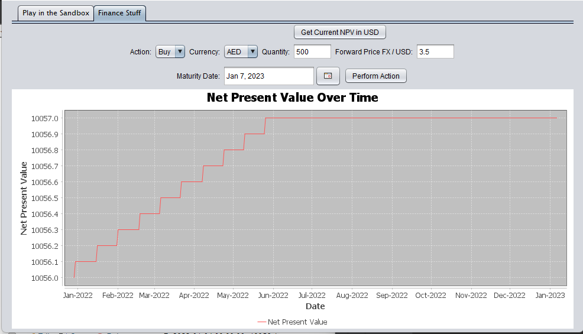

# Finance
This program is a tool for users to predict what will happen with their currency over time given the forward rate and 
foreign exchange rates they enter. The first page of the program is a sandbox where users can enter how much money they 
wish to begin with and add different actions that could be done with the money given certain specifactions of the action. 
Many "what if" actions can be added to the sandbox and the user can visualize what different 
actions will do to their finances. 

The second page of the program is a simulation of what happens to users' finances based on 
financial actions they take. The user selects an action from a dropdown menu, enters the foreign currency, quantity of 
money, forward price, and date of maturity. A PnL chart shows a visual representation of the financial action. 

  
Collaborators: 
- [Rachel Brisman](https://github.com/RachelBrisman)  
- [Chaya Haor](https://github.com/ChayaHaor)  
- [Rachel Nemesure](https://github.com/RachelRebecca)  
- [Sara Stavnitser](https://github.com/sarastavnitser)  
